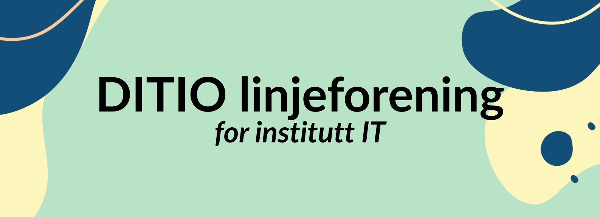

# Hallo og velkommen

til nettsiden til de nyoppstartetde linjeforeningen D.IT-I/O ved OsloMet!\
Denne foreningen tilhører alle linjene som hører til under [insitutt for informasjonsteknologi](https://www.oslomet.no/om/tkd/it).\
Vil du vite mer, eller bli med?

Ta en titt på [om foreningen](), så får du vite mer!

Sjekk ut og følg [vår Instagram](https://www.instagram.com/d.itio/)!

Mer info kommer!

Denne siden er midlertidig og WIP intill noen har ordnet noe bedre.\
Vil du lage bidra til denne nettsiden eller lage en en ny nettside til linjeforeningen?\
Gjør PR på [repoet til denne siden](https://github.com/Ditio-Linjeforeningen/ditio-nettside-hugo) 
eller lag noe nytt, og flytt repoet linjeforeningens [github organiasjonen](https://github.com/Ditio-Linjeforeningen).\
[Her er forslag til krav hvis du vil lage en ny nettside.](https://github.com/Ditio-Linjeforeningen/forslag-til-ny-nettside-krav)
Lag gjerne PR hvis du har noe forslag til endringer der også.

*Midlertidig logo, bør lages noe ordentlig på et tidspunkt. Sånn at man blant annet har SVG.\
Har du et en ide og design som vi kan bli vår permanente logo? Ta kontakt på eposten under eller styrets medlemmer!

# Kontakt info

Er du en student med spørsmål eller forslag, til forengingen, eller en bedrift som har lyst å gjøre noe for foreningens medlemmer?\
Ta kontakt på [ditio.kontakt@gmail.com](mailto:ditio.kontakt@gmail.com)!