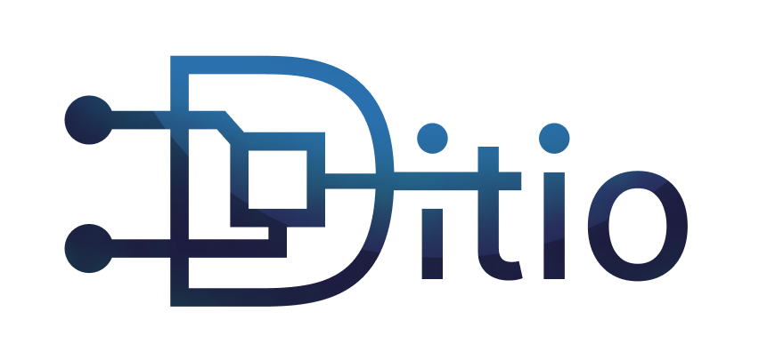

# Hallo og velkommen

til nettsiden til de nyoppstartetde linjeforeningen D.IT-I/O ved OsloMet!\
Denne foreningen tilhører alle linjene som hører til under [insitutt for informasjonsteknologi](https://www.oslomet.no/om/tkd/it).\
Ditio sitt formål å være en sosial og faglig forening for studentene ved institutt IT på OsloMet og andre interessenter.

Vil du vite mer?\
Ta en titt på [om foreningen](), så får du vite mer!

Sjekk ut og følg [vår Instagram](https://www.instagram.com/d.itio/) og [vår Linkedin](https://www.linkedin.com/company/ditio-linjeforening/)!

Mer info kommer!

Denne siden er midlertidig og WIP intill noen har ordnet noe bedre.\
Vil du lage bidra til denne nettsiden eller lage en en ny nettside til linjeforeningen?\
Gjør PR på [repoet til denne siden](https://github.com/Ditio-Linjeforeningen/ditio-nettside-hugo) 
eller lag noe nytt, og flytt repoet linjeforeningens [github organiasjonen](https://github.com/Ditio-Linjeforeningen).\
[Her er forslag til krav hvis du vil lage en ny nettside.](https://github.com/Ditio-Linjeforeningen/forslag-til-ny-nettside-krav)
Lag gjerne PR hvis du har noe forslag til endringer der også.

Vi har fått Logo!

# Kontakt oss

Har du spørsmål eller forslag til foreningen?\
Ta kontakt for generelle henvendelser: [kontakt@ditio.org](mailto:kontakt@ditio.org)\
Eller [kontakt et styremedlem]()

Er du en bedrift som har lyst til å gjøre noe for foreningens medlemmer?\
Ta kontakt på: [bedrift@ditio.org](mailto:bedrift@ditio.org)